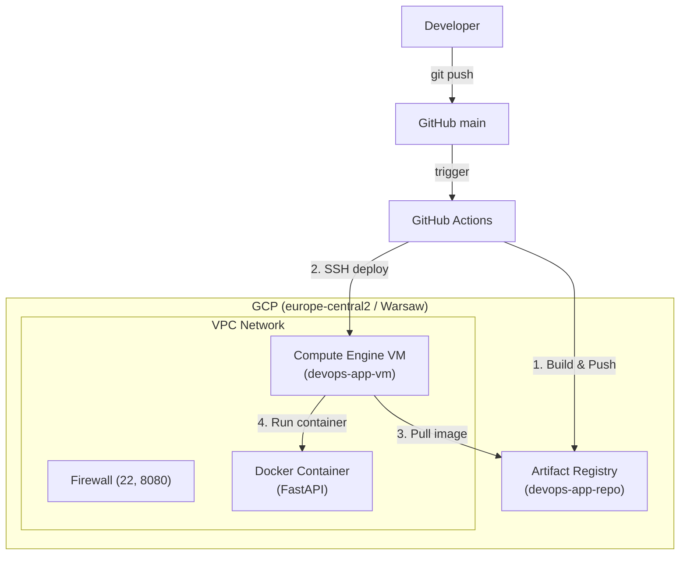

# GCP Infrastructure & CI/CD Pipeline

Automated GCP infrastructure provisioning using Terraform and a CI/CD pipeline built with GitHub Actions to deploy a FastAPI application into a Compute Engine VM.

## Architecture



## Stack

* **Infrastructure as Code:** Terraform (VPC, Subnet, Firewall rules, Compute Engine VM, Artifact Registry)
* **Cloud Provider:** Google Cloud Platform (`europe-central2` - Warsaw)
* **CI/CD:** GitHub Actions (Build, Push, SSH Deployment)
* **App & Runtime:** Python, FastAPI, Docker, `uv`
* **Security:** GCP Service Account (IAM) with GitHub Repository Secrets

## Project Structure

```text
.
├── .github/workflows/
│   └── ci.yml          # GitHub Actions workflow (CI/CD)
├── app/
│   ├── Dockerfile      # Multi-stage Docker build
│   └── main.py         # FastAPI entrypoint
└── terraform/
    ├── compute.tf      # VM Instance & Startup script
    ├── network.tf      # VPC, Subnet & Firewall
    ├── outputs.tf      # Output variables (IP, Repo URL)
    ├── providers.tf    # GCP provider configuration
    ├── registry.tf     # Artifact Registry repository
    └── variables.tf    # Project variables
```

## Troubleshooting & Key Fixes

### Docker Authentication Error during CD (`exit code 125`)

**Issue:**  
The CD step failed during `gcloud compute ssh` with `exit code 125` when trying to pull the latest image on the VM.

**Root Cause:**  
Running `sudo gcloud auth configure-docker` generated a `/root/.docker/config.json` containing `credHelpers`. When `sudo docker pull` was executed, Docker attempted to invoke `gcloud` under the `root` context, which lacked an active login session on the VM.

**Fix:**  
1. Switched to fetching an OAuth2 token directly on the runner: `ACCESS_TOKEN=$(gcloud auth print-access-token)`.
2. Passed the token via STDIN: `echo "$ACCESS_TOKEN" | sudo docker login -u oauth2accesstoken --password-stdin europe-central2-docker.pkg.dev`.
3. Purged stale Docker config prior to login: `sudo rm -f /root/.docker/config.json`.
